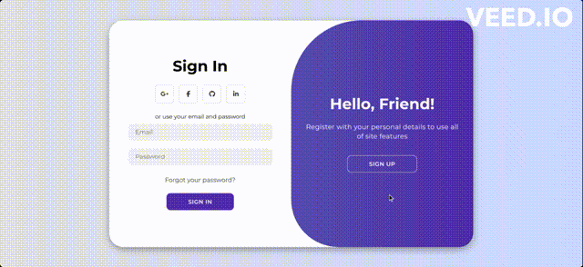

# Animated-Login-Page

## Introduction
This is a simple animated login page using HTML, CSS, and JavaScript. It is a responsive web page that can be used for any website. This project was created to learn how to use CSS transitions and animations to create a more interactive and engaging user experience.

## Demo

## Acknowledgements
I would like to thank [ASMR Programming](https://youtu.be/PlpM2LJWu-s) for providing the resource and guidance necessary to learn how to create this animated login page.

